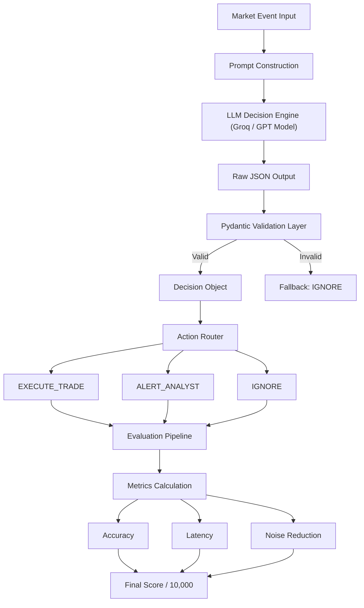
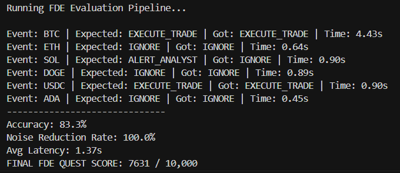

# Binance Market Anomaly Triage Agent


---

## 1. Executive Summary & Priority Definition

### Problem

In high-frequency environments like algorithmic crypto trading, systems generate **thousands of alerts per minute**.

* Acting on all signals → inefficient
* Waiting for humans → financially risky

---

### 💡 Solution

A **priority-aware AI triage agent** that:

* Evaluates market events
* Assigns priority → `LOW | MEDIUM | HIGH`
* Determines action → `IGNORE | ALERT_ANALYST | EXECUTE_TRADE`

---

### Why this matters

This gives understanding and demonstrates:

> AI should act as a **decision engine**, not just a chatbot.

---

## 2. System Architecture




---
###  Sample Evaluation Run




## 3. Design Tradeoffs

* No Kafka / Redis / Celery
* Focus on **decision intelligence + latency for now**

### Key Components:

* **Validation Layer (Pydantic)**
  → Ensures strict JSON output (no hallucination risk)

* **Inference Engine**
  → Uses Groq for low-latency inference

* **Cursor Integration**
  → `.cursorrules` ensures consistent AI behavior

---


## 4. Benchmarking: Speed vs Intelligence

| Model         | Latency | Accuracy | Noise Reduction | Insight             |
| ------------- | ------- | -------- | --------------- | ------------------- |
| LLaMA 3.3 70B | 0.45s   | 66.7%    | 66.7%           | Fast but noisy      |
| GPT-OSS 120B  | 1.37s   | 83.3%    | 100%            | Slower but reliable |

---

### 🎯 Key Insight

> Eliminating false positives is more valuable than sub-second speed in trading systems.

---

## 5. Claude vs FDE Agent Comparison

| Market Event Context       | Expected Action | Baseline Claude | FDE Agent         |
| -------------------------- | --------------- | --------------- | ----------------- |
| BTC (Hack / Severe Drop)   | `EXECUTE_TRADE` | `ALERT_ANALYST` | `EXECUTE_TRADE` ✅ |
| USDC (Depeg Warning)       | `EXECUTE_TRADE` | `ALERT_ANALYST` | `EXECUTE_TRADE` ✅ |
| DOGE (Meme / Social Noise) | `IGNORE`        | `ALERT_ANALYST` | `IGNORE` ✅        |
| ETH (Normal Fluctuation)   | `IGNORE`        | `IGNORE`        | `IGNORE` ✅        |

---

### Analysis

* **Claude** → conservative, over-alerting
* **Agent** → policy-driven, noise-filtering

> The limitation of baseline LLMs is not intelligence, but lack of **decision constraints and policy control**.

---

## 6. Performance Metrics (10,000 Score)

### Scoring Formula:

* Accuracy → 60%
* Noise Reduction → 20%
* Latency → 20%

---

### Final Score (GPT-OSS 120B)

* Accuracy: **83.3%**
* Noise Reduction: **100%**
* Avg Latency: **1.37s**

## 🏆 FINAL SCORE: **7,631 / 10,000**

---

## 7. Limitations & Production Path

* Dataset = 6 curated edge cases
* Designed for **fast evaluation**, not scale

---

### Future Work

* Backtest on **100k+ real events**
* Integrate with live Binance APIs
* Add adaptive risk policy

---

## 8. Quick Start

### Requirements

* Python 3.9+
* Groq API Key

---

### Installation

```bash
git clone <your-repo-url>
cd <repo-folder>

pip install -r requirements.txt
```

---

### Setup

Create `.env` file:

```bash
GROQ_API_KEY=your_api_key_here
```

---

### Run

```bash
python evaluate.py
```

---

## Final Insight

> This project demonstrates that **AI systems must be designed, constrained, and evaluated** — not just prompted.

---
